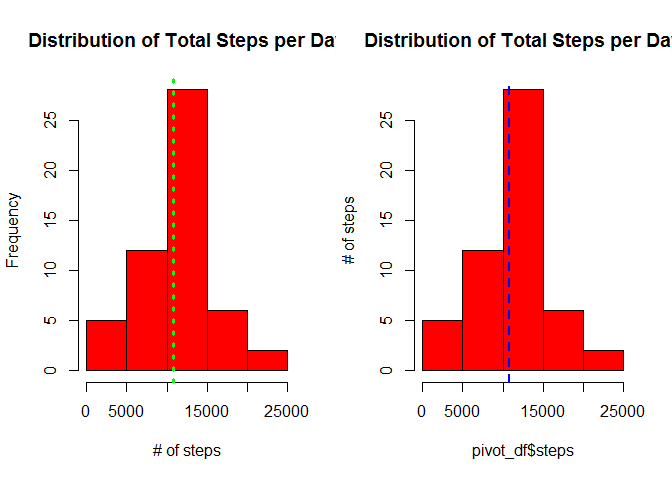
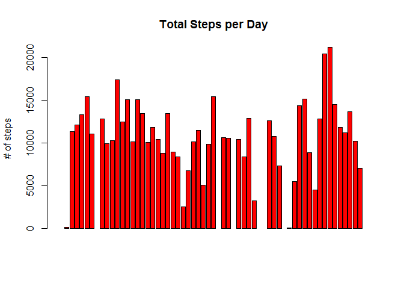
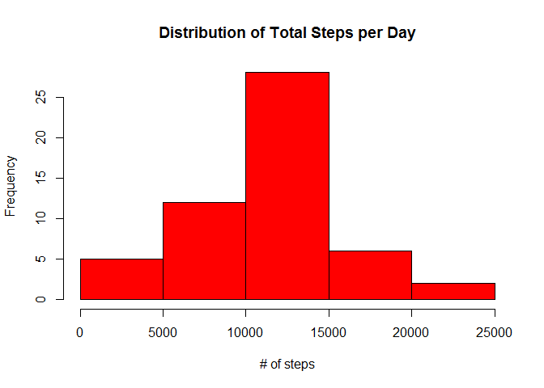

# Reproducible Research: Peer Assessment 1


## Loading and preprocessing the data
First part of assignment 1 - Getting and Cleaning the data:

```r
#setwd("C:/Users/zangl.f/Box Sync/private/Coursera/Data Science/Data Scientist Specialization/05 Reproducible Research/Assignments/RepData_PeerAssessment1/")
url <- "https://d396qusza40orc.cloudfront.net/repdata%2Fdata%2Factivity.zip"
download.file(url, "Course5Assignment1.zip")
unzip("Course5Assignment1.zip")
df <- read.csv("activity.csv", sep=",", na.strings = "NA", stringsAsFactors = F, colClasses = c(steps = "numeric", date = "character", interval = "numeric"))
df$date <- as.Date(df$date, "%Y-%m-%d")
```


## What is mean total number of steps taken per day?
Second part of assignment 1 - Reporting on the total number of steps:

- calculating the sum of steps per day
- plotting them into a histogram
- reporting the mean and median of the number of steps

```r
pivot_df <- aggregate(steps ~ date, df, sum, na.action=NULL)
head(pivot_df, 3)
```

```
##         date steps
## 1 2012-10-01    NA
## 2 2012-10-02   126
## 3 2012-10-03 11352
```

```r
barplot(pivot_df$steps, main = "Total Steps per Day", col="red", ylab="# of steps")
mean_df <- mean(pivot_df$steps)
print(paste("The MEAN of the total number of steps taken per day is ", mean_df,"(see green dotted line)."))
```

```
## [1] "The MEAN of the total number of steps taken per day is  NA (see green dotted line)."
```

```r
abline(h = mean_df, lwd = 3, lty = 3, col = "green")
```

 

```r
median_df <- median(pivot_df$steps)
print(paste("The MEDIAN of the total number of steps taken per day is ", median_df,"(see blue dashed line)."))
```

```
## [1] "The MEDIAN of the total number of steps taken per day is  NA (see blue dashed line)."
```

```r
barplot(pivot_df$steps, main = "Total Steps per Day", col="red", ylab="# of steps")
abline(h = median_df, lwd = 2, lty = 2, col = "blue")
```

 


## What is the average daily activity pattern?
Third part of assignment 1 - time series of average daily activities:

1. Make a time series plot (i.e. type = "l") of the 5-minute interval (x-axis) and the average number of steps taken, averaged across all days (y-axis)

```r
pivot_2_df <- aggregate(steps ~ interval, df, mean)
with(pivot_2_df, plot(interval, steps, type = "l"))
```

 

2. Which 5-minute interval, on average across all the days in the dataset, contains the maximum number of steps?

```r
max_interval <- pivot_2_df[which.max(pivot_2_df$steps),]
print(paste("The interval with the maximum number of average steps is", max_interval$interval,"and has", round(max_interval$steps, 1),"steps."))
```

```
## [1] "The interval with the maximum number of average steps is 835 and has 206.2 steps."
```


## Imputing missing values
Fourth part of assignment 1 - missing values:

Note that there are a number of days/intervals where there are missing values (coded as NA). The presence of missing days may introduce bias into some calculations or summaries of the data.

1. Calculate and report the total number of missing values in the dataset (i.e. the total number of rows with NAs)

```r
t <- sum(!complete.cases(df))
print(paste("The total number of rows with NAs is", t,"rows."))
```

```
## [1] "The total number of rows with NAs is 2304 rows."
```

2. Devise a strategy for filling in all of the missing values in the dataset. The strategy does not need to be sophisticated. For example, you could use the mean/median for that day, or the mean for that 5-minute interval, etc.

```r
corrected_na <- df[is.na(df$steps),]
corrected_na$steps <- pivot_2_df$steps[pivot_2_df$interval == corrected_na$interval]
```

3. Create a new dataset that is equal to the original dataset but with the missing data filled in.

```r
clean_ds <- rbind(df[complete.cases(df),],corrected_na)
```

4. Make a histogram of the total number of steps taken each day and Calculate and report the mean and median total number of steps taken per day. Do these values differ from the estimates from the first part of the assignment? What is the impact of imputing missing data on the estimates of the total daily number of steps?


## Are there differences in activity patterns between weekdays and weekends?


